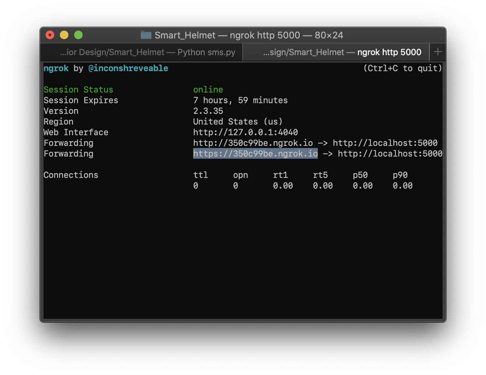

#
# Concushion Smart Helmet
<br></br>
## How to run the iOS app
 
### For the text message functionality you must:
1. Start up flash server script

 ```bash
python3 sms.py
```

2. Create ngrok URL

 ```bash
ngrok http 5000
```

3. Copy the ngrok https URL 



4. Paste URL into 'url' variable in CollisionTimer.swift > func sendMsg() > url

 ```Swift
func sendMsg(number: String, address: String){
        .
        .
    let url = "https://350c99be.ngrok.io"
```

5. Build and run the app
 
Note - the python script isn't in the repo, I have to send it to you separately.
